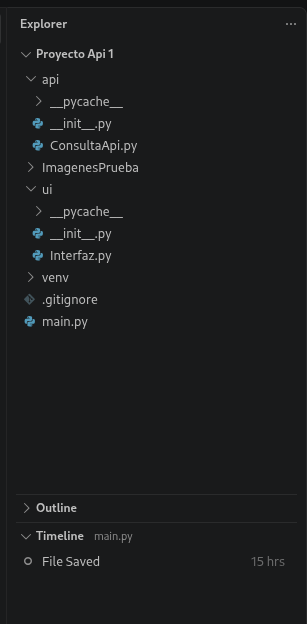
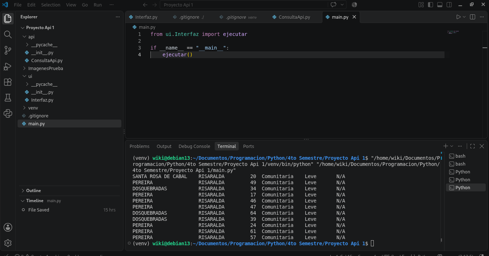
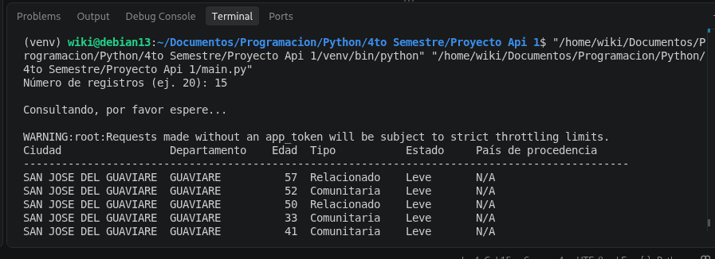
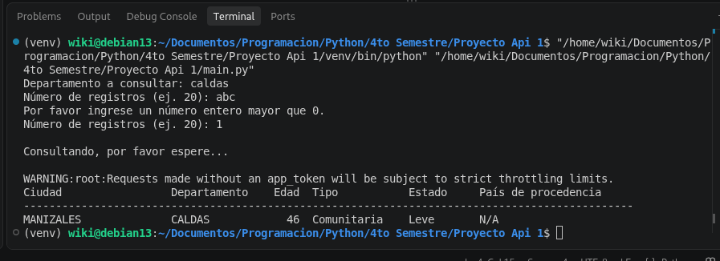
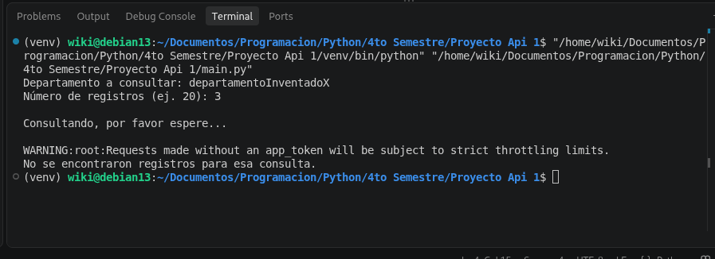

# Proyecto Fundamentos Básicos de Python

Primer Proyecto de API de Progra III. Consulta de casos positivos de COVID-19 en Colombia usando la API de datos.gov.co.

## Estructura del proyecto

## Pantallazos

### Consulta normal 

### Consulta normal 2

### Número inválido

### Departamento inexistente

## Marco teórico

### ¿Qué es un componente?
Un componente es una parte modular, reutilizable y reemplazable de un sistema de software que encapsula una funcionalidad específica. Esconde su implementación interna y se comunica con el resto del sistema a través de interfaces bien definidas: las interfaces provistas y las interfaces requeridas.

### ¿Qué es un Diagrama de Componentes?
Es un diagrama del lenguaje UML (Lenguaje Unificado de Modelado) que representa la estructura física o lógica de un sistema mostrando sus componentes y las relaciones de dependencia entre ellos. Cada componente se dibuja como un rectángulo con el símbolo de componente, y las dependencias se dibujan como flechas que indican qué componente usa a cuál. También puede mostrar las interfaces que cada uno ofrece o requiere.

### ¿Para qué se utiliza?
Se utiliza para:

Visualizar la arquitectura del software y cómo se divide en módulos.
Entender las dependencias: qué componente necesita de cuál, y detectar acoplamientos excesivos o dependencias circulares.
Planificar y documentar el diseño antes o después de programar.
Facilitar el mantenimiento y el trabajo en equipo, porque cada persona puede ocuparse de un componente sin conocer todos los detalles de los demás.
Comunicar el diseño a otras personas.

